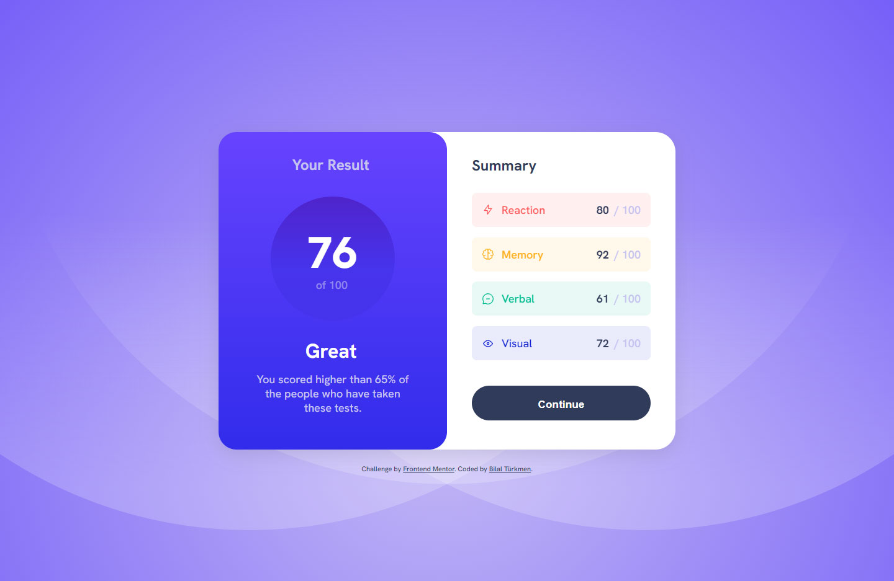

<h1 >Results summary component</h1>

  <h3>
    <a href="https://results-summaryy.netlify.app/"> Live View </a>
     | 
    <a href="https://www.frontendmentor.io/solutions/results-summary-component-with-react-js-oY58nHZGtW"> Solution Page </a>
  </h3>

  A challenge on Frontend Mentor.

## 👍 My Challenges:

- added calculation and celebration effect.
- And also presenting a good page experience.
- See hover states for all interactive elements on the page.

## 🎉 Build With:

- React js and Vite builder
- Semantic HTML5 markup
- Flexbox & Css Grid
- Mobile-first workflow
- CSS custom properties
